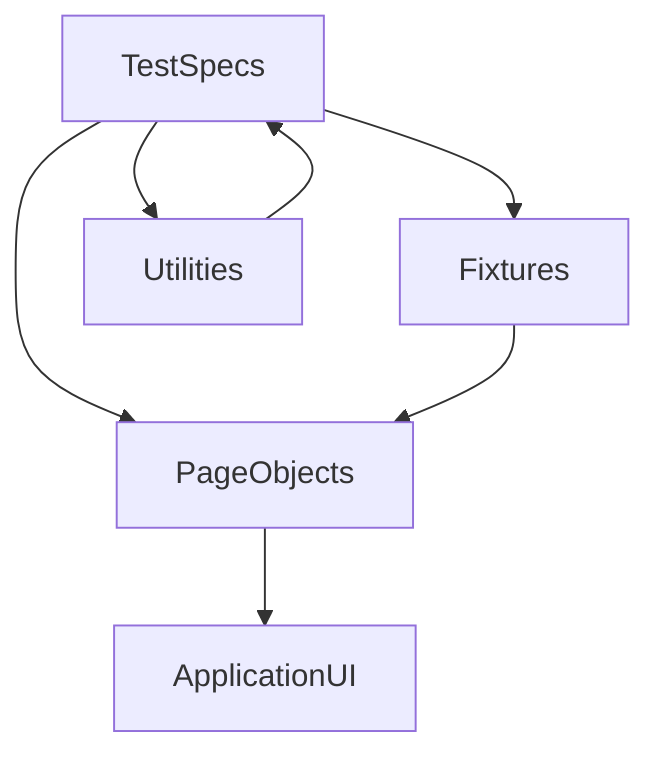

# Test Automation Architecture

Этот документ является опорной архитектурной спецификацией проекта автотестов.

Его цель:

- зафиксировать текущие архитектурные решения
- дать единые правила для написания новых тестов
- снизить риск деградации качества при рефакторинге
- упростить onboarding нового AQA-инженера

Документ нужно использовать как reference при:

- добавлении новых автотестов
- рефакторинге существующих тестов
- изменении page object
- изменении CI и quality gates
- расширении структуры проекта

## 1. Архитектурная цель проекта

Проект должен оставаться:

- читаемым
- воспроизводимым
- легко расширяемым
- устойчивым к UI-изменениям
- пригодным для локального запуска и CI

Главная задача архитектуры не в том, чтобы сделать много абстракций, а в том, чтобы обеспечить:

- быструю разработку
- простую поддержку
- предсказуемый refactoring
- низкую стоимость сопровождения

## 2. Архитектурные принципы

### KISS

Решения должны быть настолько простыми, насколько это возможно без потери качества.

Нельзя:

- вводить лишние уровни абстракций
- строить framework внутри framework
- выносить код “на будущее”, если нет реального кейса

### DRY

Повторяющаяся логика должна выноситься в:

- page object
- fixture
- utility

Но DRY не должен ухудшать читаемость.  
Если абстракция скрывает смысл теста, значит она избыточна.

### SOLID

В контексте этого проекта SOLID применяется так:

- test spec отвечает за проверку поведения
- page object отвечает за доступ к UI и действия
- utility отвечает за чистые вспомогательные операции
- fixture отвечает за wiring и подготовку окружения

### YAGNI

Не добавлять:

- отдельные data factories без реальной необходимости
- сложные inheritance-иерархии для page objects
- лишние service-слои для простых UI-проверок
- универсальные abstractions “на вырост”

## 3. Логическая схема слоев



## 4. Текущее разбиение по слоям

### `tests/`

Слой сценариев и assertions.

Обязанности:

- описывать бизнес-проверки
- связывать шаги с ожидаемым результатом
- использовать `test.step`, когда это повышает читаемость отчета
- проверять результат, а не внутреннюю реализацию

Не должен:

- хранить сложные CSS/XPath-селекторы
- содержать технические преобразования, не относящиеся к сценарию
- дублировать page-level действия

### `pages/`

Слой page objects.

Обязанности:

- инкапсулировать стабильные локаторы
- описывать действия пользователя и доступ к UI-данным
- возвращать данные в удобном для тестов виде

Не должен:

- содержать `expect`, кроме очень редких инфраструктурных кейсов
- превращаться в “god object”
- смешивать несколько независимых страниц в одном классе без причины

### `fixtures/`

Слой конфигурации test context.

Обязанности:

- создавать и внедрять page objects
- централизовать часто используемую подготовку контекста
- снижать boilerplate

Не должен:

- содержать бизнес-логику тестов
- скрывать критически важные шаги сценария

### `utils/`

Слой чистых утилит.

Обязанности:

- нормализация строк
- работа с URL
- небольшие вычисления и преобразования

Utility-функции должны быть:

- детерминированными
- маленькими
- без побочных эффектов, если это возможно

### `.github/workflows/`

Слой CI.

Обязанности:

- запускать обязательный quality gate
- обеспечивать воспроизводимость проверок
- сохранять диагностические артефакты

## 5. Карта текущих файлов

### `tests/onliner-homepage.spec.js`

Главный spec-файл текущего набора.  
Содержит сценарии TC-01..TC-10.

### `pages/home.page.js`

Page object главной страницы.  
Содержит:

- ключевые локаторы
- методы доступа к навигации
- логотип
- поиск
- футер
- получение структурированных данных по ссылкам

### `fixtures/home.fixture.js`

Фикстура, которая подключает `HomePage` к тестам.

### `utils/url.js`

Утилиты для:

- построения абсолютного URL
- проверки принадлежности URL к экосистеме onliner
- проверки допустимых `pathname`

### `utils/text.js`

Утилита нормализации текста для устойчивых сравнений.

### `playwright.config.js`

Центральная конфигурация Playwright:

- `baseURL`
- retries
- workers
- trace
- reporter
- browser project

## 6. Правила написания новых тестов

При добавлении нового теста придерживаться следующего порядка:

1. Сначала определить бизнес-поведение, которое нужно проверить.
2. Затем определить, есть ли уже подходящий page object или метод.
3. Если общего метода нет, добавить его в page object.
4. Если нужна общая преобразующая логика, добавить ее в `utils/`.
5. После этого написать тест с понятным названием и явными assertion.

### Формат теста

Тест должен:

- иметь однозначное имя
- описывать наблюдаемое поведение
- быть независимым от других тестов
- быть воспроизводимым локально и в CI

Хорошо:

- `TC-07: ссылка на каталог присутствует и отдает успешный ответ`
- `пользователь видит кнопку входа`

Плохо:

- `check nav`
- `test homepage`
- `verify data`

## 7. Правила селекторов

Приоритет выбора селекторов:

1. семантические локаторы Playwright (`getByRole`, `getByLabel`, `getByText`) — если они реально стабильны
2. стабильные product-ориентированные CSS-классы
3. узкие CSS-локаторы, привязанные к устойчивой DOM-структуре
4. fallback-локаторы только если нет альтернативы

### Нельзя

- использовать чрезмерно широкие селекторы
- матчить “любой подходящий элемент”
- строить тест на случайном первом найденном элементе, если можно выбрать более точный
- привязываться к декоративной верстке, если есть продуктовый контейнер

### Нужно

- объяснять выбор нестандартного селектора в коде или документации
- выбирать локаторы, переживающие незначительные UI-изменения
- периодически пересматривать селекторы при крупных изменениях страницы

## 8. Правила assertions

Assertions должны жить в тестах, а не в page object.

Исключение допустимо только для инфраструктурных проверок, если без этого резко страдает читаемость.

Тест должен проверять:

- то, что важно пользователю
- то, что соответствует test case
- то, что действительно может сломаться

Не нужно проверять:

- внутренние детали реализации без бизнес-ценности
- слишком много второстепенных условий в одном тесте
- одно и то же поведение в пяти местах без причины

## 9. Правила работы с Page Object

Page object должен быть:

- компактным
- предметным
- понятным без чтения всего проекта

### Когда добавлять новый page object

Новый page object нужен, если:

- появляется новая страница или крупный независимый раздел
- текущий объект становится перегруженным
- логика и локаторы начинают относиться к другой области интерфейса

### Когда не нужен новый page object

Не нужно создавать новый page object, если:

- это один локатор или один маленький helper
- логика все еще относится к текущей странице
- новый класс только усложнит навигацию по коду

## 10. Refactoring Guide

Рефакторинг допустим только если он улучшает хотя бы один из пунктов:

- читаемость
- надежность
- переиспользуемость
- устойчивость к изменению UI
- скорость диагностики падений

### Перед рефакторингом проверить

- меняется ли внешний контракт тестов
- сохраняется ли понятность сценариев
- не уходит ли assertion-логика в page object
- не появляются ли неиспользуемые abstractions

### После рефакторинга обязательно проверить

- `npm run format:check`
- `npm run lint`
- `npm run ci:test`

Или одним запуском:

```bash
npm run check
```

## 11. Правила добавления новых папок и модулей

Новая папка должна появляться только если:

- там будет устойчиво жить отдельный тип сущностей
- это улучшает навигацию по проекту
- это снижает связность, а не увеличивает ее

Перед созданием новой папки задать себе вопросы:

- можно ли обойтись существующей структурой?
- появится ли в этой папке минимум несколько логически связанных файлов?
- будет ли новому участнику команды легче понять проект?

## 12. CI и pre-push политика

Минимальный обязательный сценарий перед `push`:

```bash
npm run check
```

CI должен оставаться source of truth для:

- воспроизводимости
- качества кода
- проверки стабильности тестов

Локально нужно стремиться повторять то, что запускается в CI.

## 13. Что считать хорошим изменением в проекте

Хорошее изменение:

- уменьшает хрупкость тестов
- упрощает понимание кода
- не ломает существующий контракт
- не раздувает архитектуру
- улучшает диагностику падений

Плохое изменение:

- добавляет лишнюю сложность
- размазывает ответственность между слоями
- делает селекторы менее точными
- прячет важные assertions слишком глубоко
- вводит “магические” helper-методы без явной пользы

## 14. Checklist для новых автотестов

Перед merge проверить:

- тест отражает реальный test case
- имя теста понятно без чтения реализации
- локаторы устойчивы
- assertions находятся в тесте
- повторяющаяся логика вынесена корректно
- новый код не ломает существующую структуру
- `npm run check` проходит

## 15. Checklist для архитектурного ревью

Если в проекте меняется структура, нужно проверить:

- зачем нужен новый слой или папка
- можно ли решить задачу проще
- не дублируется ли уже существующая функциональность
- не ухудшается ли onboarding
- не становится ли проект сложнее без реальной выгоды

## 16. Правило эволюции проекта

Проект должен расти эволюционно, а не революционно.

Это означает:

- сначала решаем текущую задачу хорошо
- затем выносим только реально повторяющееся
- затем пересматриваем архитектуру, если появились новые устойчивые паттерны

Не нужно пытаться заранее проектировать структуру под десятки будущих сценариев, если сейчас в этом нет подтвержденной необходимости.

## 17. Когда обновлять этот документ

Документ нужно обновлять, если меняется хотя бы один из пунктов:

- структура проекта
- правила добавления тестов
- правила селекторов
- подход к page objects
- CI-процесс
- quality gate
- стратегия refactoring

Если код уже изменился, а документ нет, документ считается устаревшим и должен быть приведен в актуальное состояние в рамках того же изменения.

## 18. Стратегия тегов и тестовых наборов

Чтобы проект масштабировался без хаоса, каждый новый тест должен иметь понятную принадлежность к набору.

Рекомендуемая стратегия:

- `@smoke` — быстрые критические проверки, обязательны в CI на каждый PR
- `@regression` — полный функциональный регресс
- `@visual` — визуальные проверки (если будут добавлены)
- `@api` — проверки через `request`-контекст

Правила:

- не использовать теги “про запас”
- не ставить `@smoke` на все тесты подряд
- поддерживать пересмотр тегов при каждом расширении набора

## 19. Политика флаки-тестов

Флаки-тесты не должны замалчиваться.

Если тест нестабилен:

1. Зафиксировать причину флака в PR/issue.
2. Исправить источник нестабильности (селектор, синхронизация, данные, ожидания).
3. Временное повышение `retries` для конкретного теста допустимо только как краткосрочная мера.
4. Если тест временно выключается, нужно явно указать срок и условие возврата.

Запрещено:

- оставлять flaky-тест в `@smoke` без remediation-плана
- считать retry “финальным решением”

## 20. Подход к тестовым данным и окружениям

Тесты должны быть environment-aware и не зависеть от случайного состояния.

Правила:

- базовый URL задается через `BASE_URL`
- все URL- и текстовые преобразования выносить в `utils/`
- не хардкодить чувствительные данные в тестах
- если появятся секреты, хранить их только в CI secrets или локальном `.env` (не коммитить)

При добавлении нового окружения:

- задокументировать его в `README.md`
- проверить совместимость `npm run check`
- убедиться, что smoke-набор воспроизводим

## 21. Наблюдаемость и диагностика падений

Каждое падение должно быть быстро диагностируемо.

Минимальные требования:

- человекочитаемое имя теста
- понятные `test.step` в сложных сценариях
- сохранение `trace` и `screenshot` на падениях
- публикация CI-артефактов (`playwright-report`, `test-results`)

Если корень проблемы неочевиден:

- первым шагом анализировать trace и контекст ошибки
- вторым шагом проверять устойчивость локатора и ожиданий
- только потом менять бизнес-проверку

## 22. Политика обновления зависимостей

Проект использует фиксированные версии зависимостей для воспроизводимости.

Рекомендации:

- обновлять зависимости небольшими батчами
- после обновления всегда запускать `npm run check`
- изменения lockfile коммитить вместе с `package.json`
- не обновлять стек в рамках несвязанной feature-задачи

Если обновление ломает стабильность:

- сначала стабилизировать набор тестов
- затем доработать архитектурный документ и `README.md`, если контракт запуска изменился

## 23. Definition of Done для изменений в автотестах

Изменение считается завершенным, если:

- тесты/рефакторинг соответствуют архитектурным правилам документа
- добавленные селекторы устойчивы и объяснимы
- нет избыточных абстракций
- `npm run check` проходит локально
- документация обновлена при изменении архитектурного контракта

Если хотя бы один пункт не выполнен, задача не считается завершенной.
